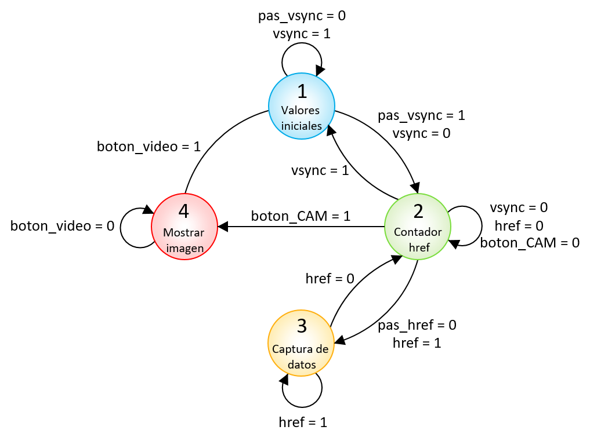

## GRUPO DE TRABAJO 05

## INTEGRANTES DEL GRUPO
#### Jhohan David Contreras Aragón		1007687796
#### Andrés Felipe Medina Medina 		1015464557
#### Mitchell Elizabeth Rodríguez Barreto	1032503089

Figura []. Diagrama estructural de toda la descripción del hardware de la cámara

Figura []. Diagrama funcional del módulo diseñado *cam_read.v*

Figura []. Máquina de estado finitos para la captura de datos y contadores

Figura []. Estados según las señales enviadas por la cámara

Figura []. Diagrama de las conexiones entre la FPGA, la cámara y el Arduino Mega