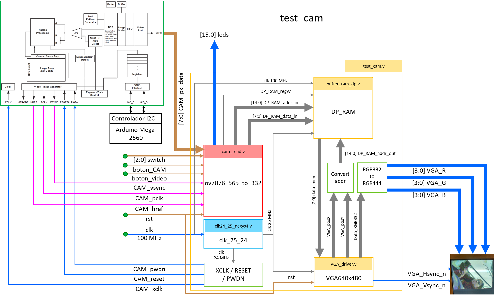
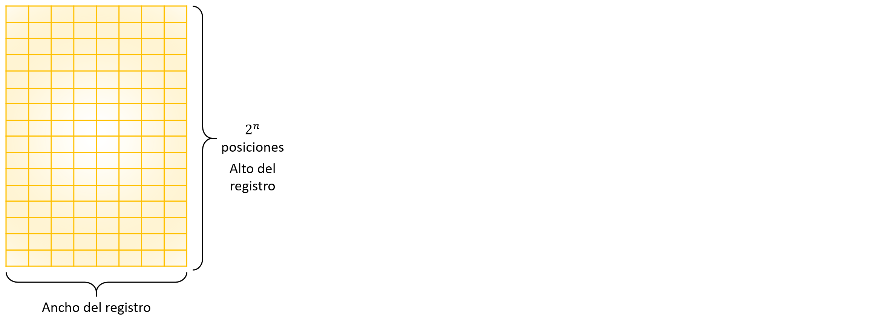

## GRUPO DE TRABAJO 05

## INTEGRANTES DEL GRUPO
#### Jhohan David Contreras Aragón		1007687796
#### Andrés Felipe Medina Medina 		1015464557
#### Mitchell Elizabeth Rodríguez Barreto	1032503089

Figura []. Diagrama estructural de toda la descripción del hardware de la cámara

Figura []. Diagrama funcional del módulo diseñado *cam_read.v*

Figura []. Máquina de estado finitos para la captura de datos y contadores

Figura []. Estados según las señales enviadas por la cámara

Figura []. Diagrama de las conexiones entre la FPGA, la cámara y el Arduino Mega

## Máxima memoria RAM

Para determinar el tamaño máximo del buffer de memoria RAM que se puede crear con la FPGA, en este caso la Nexys 4 DDR, primero se revisó el datasheet y se encontró que el valor de bloque de memoria RAM en la FPGA es de 4.860.000 bits.

Para calcular el número de bits que va a ocupar la memoria se debe tener en cuenta el formato del pixel con el que se va a trabajar, ya que este define la cantidad de bits que necesita cada pixel para conformar la imagen final.El formato de imagen escogido es el RGB 332, en donde cada píxel necesita 8 bits, es decir, cada pixel está conformado por 1 byte. Por lo tanto, el tamaño de la RAM está definido de la siguiente manera:

En donde cada fila es un pixel, por ende la altura está definida por la cantidad de pixeles que hay en la imagen y la cantidad de columnas representa la cantidad de bits por pixel en este caso 8.
* Para una imagen de 640 x 480 píxeles el número de posiciones en una memoria está dado por 2^n, en éste caso, como el número de pixeles a usar es de 640 x 480 = 307.200, se busca un exponente tal que 2 elevado a ese exponente sea mayor o igual a 307.200. Para encontrar el valor de _n_ se halla el logaritmo en base 2 de 307.200 y como el exponente debe ser entero, ya que es la altura de una matriz, se redondea el resultado al entero mayor más cercano.

El tamaño en bits de la memoria RAM sería el número de posiciones por el ancho del registro:

Como se puede observar el número de bits es cercano al máximo permitido en la tarjeta más es conveniente alejarse de ese valor ya que la memoria no puede llegar a llenarse y hacer que deje de funcionar correctamente la FPGA así.

* Para una imagen de 160 x 120 píxeles.
Se decide recortar el tamaño de la imagen para que no exceda la capacidad de la FPGA, se escala por un factor de 4, por lo que la nueva imagen es ahora 1/16 del tamaño con respecto al tamaño anterior. Ahora el número de posiciones, o píxeles, totales es de 160 x 120 = 19.200. Se hace el mismo procedimiento y se encuentra que el exponente de 2 más cercano que almacena esta cantidad de pixeles es:

Como se puede observar el tamaño en bits de la memoria RAM para una imagen de 160 x 120 píxeles ocuparía el 5.40 % de la memoria disponible en la FPGA, por lo tanto, se decide usar este tamaño. El tamaño en bytes sería de 32.768.

## Buffer RAM

Para la creación del buffer de memoria se tuvieron en cuenta los parámetros encontrados anteriormente, como los son la cantidad de bits de la dirección (*AW = 15*) y la cantidad de bits de los datos (*DW = 8*). Además, se exportó como parámetro el archivo *image.men* que contiene valores hexadecimales para la creación de líneas horizontales azules claras y rojas que luego serán precargadas en la memoria RAM para inicializarla. Se tomaron como valores de entrada y salida los siguientes:

#### Entradas:
* *clk_w:* Reloj para la escritura de los datos, en este caso la señal *PCLK* que envía la cámara.
* *addr_in [14:0]:* La dirección de entrada en la cual serán guardados los datos.
* *data_in [7:0]:* El dato de entrada, es decir, el pixel en formato RGB 332.
* *regwrite:* Señal que controla cuando se escribe en la memoria RAM.
* *clk_r:* Reloj para la lectura de los datos, en este caso es *25 MHz* la misma frecuencia a la que operan las pantallas VGA.
* *addr_out [14:0]:* La dirección del dato que debe leer en la memoria para mostrarlo en pantalla.

#### Salidas:
* *data_out [7:0]:* El dato que debe mostrar según la dirección brindada.

Se define un parámetro local para realizar el cálculo de la cantidad de bits de la dirección *2^AW = 2^15*, se crea la RAM tomando como “ancho” de registro 8 bits y un “alto” de 32.768 posiciones.

Para la escritura de los datos se tuvo en cuenta que siempre estuviera en los flancos de subida del reloj de escritura (*PCLK*) y que *regwrite* fuera igual a 1. El pixel *data_in* se guarda en la posición *addr_in*.

La lectura de los datos se sincronizó con el reloj de *25 MHz* y asigna a *data_out* el valor en la posición de memoria *addr_out*. Se inicializa la RAM como se había dicho anteriormente y la última posición se hace igual a cero.

Se realizó una simulación para comprobar que la memoria RAM responda a los estímulos de lectura y escritura correctamente.

Primero se observa la lectura de algunos de los datos precargados en la RAM por medio del archivo imageFILE = "image.men".

Luego se puede notar la escritura de 5 datos diferentes.

Y finalmente la lectura de los datos añadidos anteriormente.

