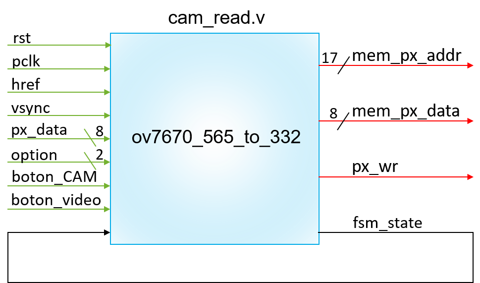
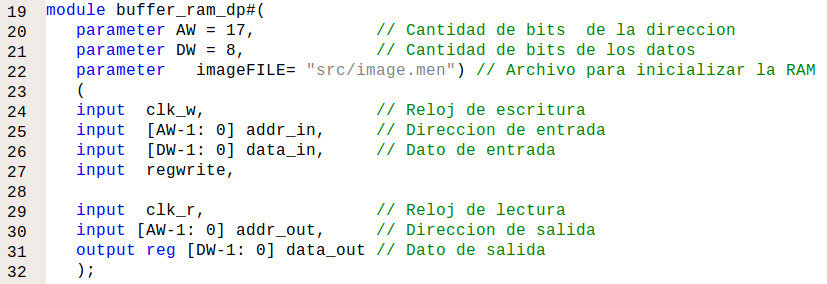

## GRUPO DE TRABAJO 05

## INTEGRANTES DEL GRUPO
#### Jhohan David Contreras Aragón		1007687796
#### Andrés Felipe Medina Medina 		1015464557
#### Mitchell Elizabeth Rodríguez Barreto	1032503089

Figura []. Diagrama estructural de toda la descripción del hardware de la cámara

Figura []. Diagrama funcional del módulo diseñado *cam_read.v*

Figura []. Máquina de estado finitos para la captura de datos y contadores

Figura []. Estados según las señales enviadas por la cámara

Figura []. Diagrama de las conexiones entre la FPGA, la cámara y el Arduino Mega

Figura []. Diagrama estructural de la captura de datos

Figura []. Diagrama funcional del buffer de la memoria RAM

Figura []. Diagrama funcional del buffer de la memoria RAM

## Máxima memoria RAM

Para determinar el tamaño máximo del buffer de memoria RAM que se puede crear con la FPGA, en este caso la Nexys 4 DDR, primero se revisó el datasheet y se encontró que el valor de bloque de memoria RAM en la FPGA es de 4.860.000 bits.

Para calcular el número de bits que va a ocupar la memoria se debe tener en cuenta el formato del pixel con el que se va a trabajar, ya que este define la cantidad de bits que necesita cada pixel para conformar la imagen final. El formato de imagen escogido es el RGB 332, en donde cada pixel necesita 8 bits, es decir, cada pixel está conformado por 1 byte. Por lo tanto, el tamaño de la RAM está definido de la siguiente manera:

Figura []. Tamaño del registro

En donde cada fila es un pixel, por ende la altura está definida por la cantidad de pixeles que hay en la imagen y la cantidad de columnas representa la cantidad de bits por pixel en este caso 8.
* Para una imagen de 640 x 480 píxeles el número de posiciones en una memoria está dado por 2^n, en éste caso, como el número de pixeles a usar es de 640 x 480 = 307.200, se busca un exponente tal que 2 elevado a ese exponente sea mayor o igual a 307.200. Para encontrar el valor de _n_ se halla el logaritmo en base 2 de 307.200 y como el exponente debe ser entero, ya que es la altura de una matriz, se redondea el resultado al entero mayor más cercano.

El tamaño en bits de la memoria RAM sería el número de posiciones por el ancho del registro:

Como se puede observar el número de bits es cercano al máximo permitido en la tarjeta más es conveniente alejarse de ese valor ya que la memoria no puede llegar a llenarse y hacer que deje de funcionar correctamente la FPGA así.

*	Para una imagen de 320 x 240 píxeles. 
Se decide recortar el tamaño de la imagen para que no exceda la capacidad de la FPGA, se escala por un factor de 2, por lo que la nueva imagen es ahora 1/4 del tamaño con respecto al tamaño anterior. Ahora el número de posiciones, o píxeles, totales es de 320 x 240 = 76.800. Se hace el mismo procedimiento y se encuentra que el exponente de 2 más cercano que almacena esta cantidad de pixeles es:

Como se puede observar el tamaño en bits de la memoria RAM para una imagen de 320 x 240 píxeles ocuparía el 21.57 % de la memoria disponible en la FPGA, por lo tanto, se decide usar este tamaño. El tamaño en bytes sería de 131.072.
## Buffer RAM

Para la creación del buffer de memoria se tuvieron en cuenta los parámetros encontrados anteriormente, como los son la cantidad de bits de la dirección (*AW = 15*) y la cantidad de bits de los datos (*DW = 8*). Además, se exportó como parámetro el archivo *image.men* que contiene valores hexadecimales para la creación de líneas horizontales azules claras y rojas que luego serán precargadas en la memoria RAM para inicializarla. Se tomaron como valores de entrada y salida los siguientes:

#### Entradas:
* *clk_w:* Reloj para la escritura de los datos, en este caso la señal *PCLK* que envía la cámara.
* *addr_in [14:0]:* La dirección de entrada en la cual serán guardados los datos.
* *data_in [7:0]:* El dato de entrada, es decir, el pixel en formato RGB 332.
* *regwrite:* Señal que controla cuando se escribe en la memoria RAM.
* *clk_r:* Reloj para la lectura de los datos, en este caso es *25 MHz* la misma frecuencia a la que operan las pantallas VGA.
* *addr_out [14:0]:* La dirección del dato que debe leer en la memoria para mostrarlo en pantalla.

#### Salidas:
* *data_out [7:0]:* El dato que debe mostrar según la dirección brindada.

Se define un parámetro local para realizar el cálculo de la cantidad de bits de la dirección *2^AW = 2^15*, se crea la RAM tomando como “ancho” de registro 8 bits y un “alto” de 32.768 posiciones.

Para la escritura de los datos se tuvo en cuenta que siempre estuviera en los flancos de subida del reloj de escritura (*PCLK*) y que *regwrite* fuera igual a 1. El pixel *data_in* se guarda en la posición *addr_in*.

La lectura de los datos se sincronizó con el reloj de *25 MHz* y asigna a *data_out* el valor en la posición de memoria *addr_out*. Se inicializa la RAM como se había dicho anteriormente y la última posición se hace igual a cero.

Se realizó una simulación para comprobar que la memoria RAM responda a los estímulos de lectura y escritura correctamente.

Primero se observa la lectura de algunos de los datos precargados en la RAM por medio del archivo imageFILE = "image.men".

Luego se puede notar la escritura de 5 datos diferentes.

Y finalmente la lectura de los datos añadidos anteriormente.

## Diseño del downsampling de RGB565 a RGB332
Dada la elección del formato de imagen a trabajar siendo esta el RGB332, se conformará un pixel de 8 bits y se transmitirá al buffer de memoria. Teniendo en cuenta que el formato en el que se configuró la cámara para enviar la información del píxel es el del RGB565, es necesario  pasar de este formato al  RGB 332. Esto se logró por medio de un proceso llamado downsampling, el cual consiste en la reducción del tamaño de la información por medio de la selección o truncamiento de determinados bits. En este caso la forma de realizar el proceso de downsampling fue escogiendo los bits más significativos de cada uno de los colores según corresponda. Por ejemplo, el color rojo (RED) viene en un formato en donde contiene 5 bits y para transformarlo al otro formato en donde sólo cuenta con 3 bits, escogemos únicamente los 3 bits más significativos; para el caso del verde (GREEN) y del azul (BLUE) escogemos los 3 y 2 bits más significativos correspondientemente.

Para ello se crearon variables auxiliares internas:
* *[AW-1:0] mem_px_addr* Este registro da la dirección en memoria en donde los bits del píxel  serán guardados después del downsampling. 
* *[7:0] mem_px_data*  En este registro se guarda la información obtenida de px_data correspondiente al píxel durante el proceso de downsampling.
* *px_wr* Este registro indica si se envía o no el valor almacenado en mem_px_data a la posición de memoria asignada en la RAM.
* *cont* Este registro que no es entrada ni salida es una variable de control que indica si está leyendo el primer byte o el segundo que forma el pixel.

Ya adentrándonos en el código realizado para este fin vemos que el proceso se realiza en el módulo de captura de datos (cam_read.v) 
Primero vemos la declaración de las entradas y salidas del módulo en las cuales analizamos lo que nos interesa, que es el px_data que trae la información obtenida por la cámara y nuestros registros auxiliares que fueron explicados anteriormente.

A continuación vemos que se crea una condicional que depende de PCLK  e internamente se hace otro dentro de una máquina de estados que depende de HREF y VSYNC, la posición del píxel en el buffer de memoria dada por mem_px_adrr se asigna a la posición 0, en el caso 2 del fsm_state que se da en el primer ciclo de reloj vemos que se guardan los pixeles de las posiciones [7:5] y [2:0] de la señal de entrada de la cámara px_data guardando en ellas los valores de rojo y verde mas significativos en el registro mem_px_data lo cuales permanecen allí hasta el próximo ciclo de reloj ya que no se guardan en el buffer de memoria ya que el registro px_wr permanece en 0 y cont=0 
aunque después de ese ciclo cont=~cont, este estado es de transición puesto solo ocurre durante el primer ciclo de reloj.

Finalmente vemos que cuando fsm_state sea igual a 3 este verifica el estado del registro cont, si este es 0 vuelve a hacer lo que estaba haciendo cuando el fsm_state era igual a 2, pero en el segundo ciclo de reloj entra a la condición en el que mem_px_data almacena los datos del azul correspondientes a los datos [4:3] del px_data, además de hacer que px_wr = 1, guardando el pixel en este caso en la posición 0 del buffer de memoria, y que hace que  mem_px_adrr aumente 1, moviendo así la dirección para almacenar el proximo pixel, cont se niega volviendo a 0 y como no se sale de la condición fsm_state=3 el ciclo continúa por los 160x120 pixeles hasta que que se llena el buffer de memoria asignado.

## Reloj

Se hizo la actualización del archivo "clk_32MHZ_to_25M_24M.v" de acuerdo a las especificaciones de la FPGA Nexys 4DDR. El archivo nuevo "clk24_25_nexys4.v" está en la carpeta /hdl/src/PLL/clk24_25_nexys4.v

En las siguientes imágenes se encuentra el paso a paso de cómo se creó el nuevo PLL con Clocking Wizard.

1) Una vez tenemos el proyecto abierto en ISE vamos a tools -> Core Generator. 

2) Luego le damos doble click a "view by name" y buscamos "Clock Wizard".
 

3) Después de unos segundos se abrirá el panel de control de Clock Wizard, en donde el único cambio a realizar es en la casilla de "Source", seleccionamos la opción "Global Buffer", observamos que “Input Freq (MHz) – Value” esté en 100,000 y le damos continuar.

4) Ahora ingresamos las frecuencias de los dos relojes de salida que queremos. Primero se cambia el valor de la casilla "Output Freq (MHz) - Requested" de "CLK_OUT1" por 24,000. Para la segunda frecuencia del reloj activamos primero el reloj 2 dándole clic en la casilla frente a "CLK_OUT2" e ingresando la frecuencia deseada, en este caso 25,000. Sin cambiar nada más, le damos clic a Next.

5) En las 3 ventanas siguientes daremos next.

Observamos que los valores ingresados sean correctos.

6) En esta última ventana damos click en "Generate" y esperamos que el programa genere el código.

Después de esto se busca el archivo en la carpeta /hdl/ipcore_dir y se reemplaza en la carpeta /hdl/src/PLL, teniendo cuidado de también reemplazar el nombre del módulo en test_cam.v.

## Simulación de la cámara

Se realizó la simulación de la cámara con el fin de observar su funcionamiento, sin tener la incertidumbre si se tiene incorrecta la captura de datos o la configuración de la cámara con Arduino.

Para esto primero se realiza la simulación sin implementar el fichero ***cam_read.v***, como se observa, la simulación muestra dos pantallas, ambas con un cuadro de líneas azules y rosadas, tal como se ve en una pantalla VGA cuando no se conecta una cámara. Esto se debe a que es el valor con el que se inicializó la memoria RAM en el módulo ***buffer_ram_dp.v***.

Luego se realizan las pruebas usando el módulo diseñado ***cam_read.v***

Línea del tiempo

Antes de que se trabajara con una máquina de estados que nos permitiera capturar la información de los pixeles que nos enviaba la cámara, se trabajó con una serie de condicionales anidados según los estados actuales y pasados de las señales base (VSYNC, HREF y PCLK). Esta forma de acercamiento no es recomendable ya que se complica establecer procesos que tengan una mayor prioridad en cierta parte del proceso, es difícil saber en cuál condicional ejecutó el programa ya que las señales experimentalmente no siempre son iguales a como se describen en el Datasheet. En este punto lo que se buscaba era que se pudiese visualizar las barras horizontales de colores que fueron cargadas inicialmente en la memoria sin haber conectado la cámara, y cuando se conectase la cámara ver video. Las imágenes que obtuvimos fueron las siguientes:

     Imagen de las líneas horizontales y de la estática
     
Luego se decidió un acercamiento diferente, recomendado por el profesor, el desarrollo de una máquina de estados para la captura de datos. Así que no solo se empezó el desarrollo de la cámara sino de diferentes pruebas para encontrar los puntos problemáticos del código. Se probaron los colores por separado y se hizo una simulación de captura de datos, para probar si la conformación del pixel era correcta. La prueba de los colores individuales consistía en solo conectar los pines correspondientes al dowsampling del color deseado en HIGH y los demás en LOW, es decir, para el color rojo se toman únicamente los 3 datos más significativos del primer bus de datos. Esta prueba nos dio lo siguientes resultados:

