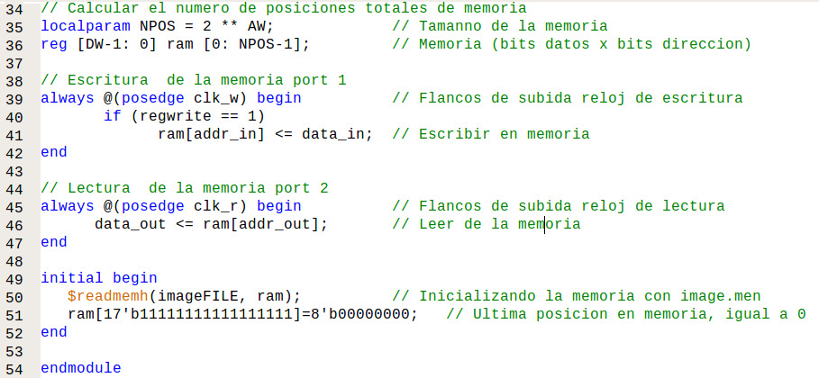
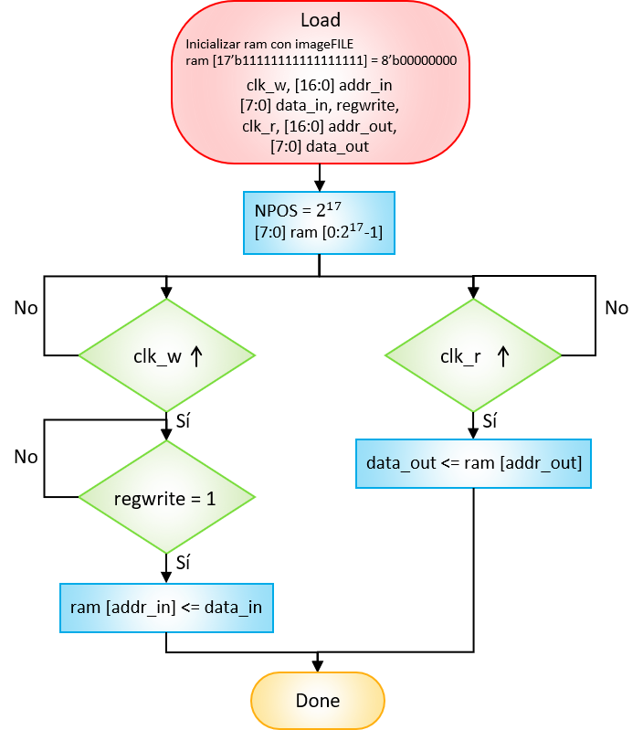
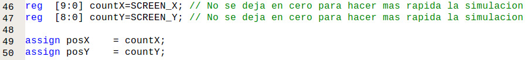

# CÁMARA DIGITAL
## GRUPO DE TRABAJO 05

## INTEGRANTES DEL GRUPO
#### Jhohan David Contreras Aragón - 1007687796
#### Andrés Felipe Medina Medina - 1015464557
#### Mitchell Elizabeth Rodríguez Barreto - 1032503089

## Objetivos

Diseñar el sistema de una cámara digital que permita por medio de botones la visualización tanto de fotos (imagen estática), como de vídeo (imágenes dinámicas) en una pantalla VGA.

### Objetivos específicos

* Analizar que se debe tener en cuenta para crear una memoria RAM que no desborde lo memoria de la FPGA.
* Realizar la captura de los datos enviados por la cámara OV7670.
* Realizar la conversión entre los diferentes formatos de pixeles soportados por la FPGA y la pantalla VGA.
* Examinar los diferentes registros y configuraciones que puede tomar la cámara.
*
* Diseñar y programar una máquina de estados finitos.
* Reconocer las características y capacidades de los elementos y diseñar con base en ellas.
* Aprender sobre sistemas síncronos, transmisión serial y paralela de información, almacenamiento y lectura de datos.

## Introducción
Como proyecto de la materia de digitales se decidió hacer crear un programa en Xilinxs que fuese capaz de recibir la información dada por una cámara digital (OV7670) y mostrarla en una pantalla estándar analógica de computadora (VGA). Para lograr dicho objetivo, es fundamental conocer los límites de los componentes con los que trabajamos, como por ejemplo: capacidad de memoria de la tarjeta programable (Nexys4DDR), formatos de imagen y de pixel que puede arrojar la cámara, frecuencias de funcionamiento, etc. Luego, se procede a hacer el análisis de las señales de salida de la cámara para crear una máquina de estados finita que permita estandarizar o crear una especie de proceso secuencial para la captura de la información en los tiempos correctos. Este paso es fundamental, ya que nos permite crear trazas del programa y así ver la información en diferentes pasos o tiempos y saber en donde está el error, en caso de haber uno.  Finalmente, manipulando diferentes registros de la cámara es posible modificar la imagen, estos registros son luz, contraste, color de matricez, etc. 

## Identificación del problema

## Módulos de la cámara

Para realizar la implementación de la cámara digital se usó el módulo principal brindado en [work02-captura-datos-0v7670-grupo-05](https://github.com/unal-edigital1-2019-2/work02-captura-datos-OV7670/tree/master/hdl/src) llamado ***test_cam.v*** en el cual:

* Se instanciaron los módulos ***clk24_25_nexys4.v***, ***cam_read.v***, ***buffer_ram_dp.v*** y ***VGA_driver.v*** (algunos brindados en el mismo repositorio). 

Figura 1. Instancia del módulo ***clk24_25_nexys4.v***.

Figura 2. Instancia del módulo ***cam_read.v***.

Figura 3. Instancia del módulo ***buffer_ram_dp.v***.

Figura 4. Instancia del módulo ***VGA_driver.v***.

* Se realizó la lógica combinacional para obtener *DP_RAM_addr_out* a partir de la posición del píxel en la pantalla.

Figura 5. Dirección DP_RAM_addr_out a partir de la dirección en la pantalla.

* Se realizó la lógica combinacional para pasar de formato RGB332 a RGB 444 para ser usado por la pantalla VGA. Para hacer dicha conversión se añadieron ceros en las cifras menos significativas faltantes, es decir, para el rojo y el verde sólo se agregó un cero para completar los 4 y en el azul dos ceros.

Figura 6. Conversión de RGB332 a RGB444.

Además se realizaron algunos cambios en este módulo, se colocó como ancho de la imagen 320 píxeles y 240 píxeles de alto y se modificó la cantidad de bits de la dirección a 17. La razón de seleccionar estos valores se explicará más adelante.

Figura 7. Parámetros modificados.

En la siguiente figura se pueden observar las entradas, salidas e interconexiones entre los módulos, los puntos verdes que se presentan en algunas entradas hace referencia a que son enviadas desde la FPGA.

Figura 8. Diagrama estructural de toda la descripción del hardware de la cámara

### Memoria RAM (***buffer_ram_dp.v***)

---

#### Máxima memoria RAM

Para diseñar la memoria RAM que almacenará los datos de la cámara y permitirá su visualización se debe primero determinar el tamaño máximo del buffer de memoria RAM que se puede crear con la FPGA, en este caso la *Artix-7* (XC7A100T-1CSG324C) de la tarjeta *Nexys 4 DDR*, para ello se revisó el datasheet y se encontró que el valor de bloque de memoria RAM en la FPGA es de *4.860.000 bits*.

Para calcular el número de bits que va a ocupar la memoria se debe tener en cuenta el formato del píxel con el que se va a trabajar, ya que este define la cantidad de bits que necesita cada píxel para conformar la imagen final. El formato de imagen escogido es el RGB332, en donde cada píxel necesita 8 bits para almacenar los datos, es decir, cada píxel está conformado por 1 byte. Por lo tanto, el tamaño de la RAM se define de la siguiente manera:

Figura 9. Tamaño del registro

En donde cada fila es un píxel, por ende, la altura está definida por la cantidad de píxeles que hay en la imagen y la cantidad de columnas representa la cantidad de bits por píxel, en este caso 8.

* Para una imagen de *640 x 480 píxeles* el número de posiciones en una memoria está dado por *2^n*, en éste caso, como el número de píxeles a usar es de *640 x 480 = 307.200*, se busca un exponente tal que 2 elevado a ese exponente sea mayor o igual a 307.200. Para encontrar el valor de _n_ se halla el logaritmo en base 2 de 307.200 y como el exponente debe ser entero, ya que es la altura de una matriz, se redondea el resultado al entero mayor más cercano.

El tamaño en bits de la memoria RAM sería el número de posiciones por el ancho del registro:

Como se puede observar el número de bits es cercano al máximo permitido en la tarjeta, más es conveniente alejarse de ese valor ya que la memoria no puede llegar a llenarse y hacer que deje de funcionar correctamente la FPGA.

*	Para una imagen de *320 x 240 píxeles.* 
Se decide recortar el tamaño de la imagen para que no exceda la capacidad de la FPGA, se escala por un factor de 2, por lo que la nueva imagen es ahora 1/4 del tamaño con respecto al tamaño anterior. Ahora el número de posiciones o píxeles totales es de *320 x 240 = 76.800*. Se hace el mismo procedimiento y se encuentra que el exponente de 2 más cercano que almacena esta cantidad de píxeles es:

Como se puede observar el tamaño en bits de la memoria RAM para una imagen de *320 x 240 píxeles* ocuparía el *21,57 %* de la memoria disponible en la FPGA, por lo tanto, se decide usar *17* como la cantidad de bits de la dirección. El tamaño total en bytes sería de 131.072.

---

Como se mencionó anteriormente, para la creación del buffer de memoria la cantidad de bits de la dirección es de *AW = 17* y la cantidad de bits de cada pixel es de *DW = 8*. Además, para inicializar la memoria se importó como parámetro el archivo *image.men* para luego precargarlo en la memoria, dicho archivo contiene valores hexadecimales para la creación de líneas horizontales azules claras y rojas. 

Las entradas y salidas tomadas para éste módulo fueron las siguientes:

#### Entradas:
* *clk_w:* Reloj para la escritura de los datos, en este caso es la señal *PCLK* que envía la cámara.
* *addr_in [16:0]:* La dirección de entrada en la cual serán guardados los datos en la memoria.
* *data_in [7:0]:* El dato de entrada, es decir, el píxel en formato RGB332.
* *regwrite:* Señal que controla cuando se escribe en la memoria RAM.
* *clk_r:* Reloj para la lectura de los datos, en este caso es *25 MHz* la misma frecuencia a la que operan las pantallas VGA.
* *addr_out [16:0]:* La dirección del dato que debe leer en la memoria para mostrarlo en pantalla.

#### Salidas:
* *data_out [7:0]:* El dato que debe ser enviada a la pantalla según la dirección brindada.

Figura 10. Declaración del módulo. Entradas, salidas y parámetros.

Se define un parámetro local para realizar el cálculo de la cantidad de bits de la dirección *2^AW = 2^17*, se crea la RAM tomando como “ancho” de registro 8 bits y un “alto” de 32.768 posiciones.

Para la escritura de los datos se tuvo en cuenta que siempre estuviera en los flancos de subida del reloj de escritura (*PCLK*) y que *regwrite* fuera igual a 1. El píxel *data_in* se guarda en la posición *addr_in*.

La lectura de los datos se sincronizó con el reloj de *25 MHz* y asignó a *data_out* el valor en la posición de memoria *addr_out*. Se inicializa la RAM como se había dicho anteriormente y la última posición se hace igual a cero.

Figura 11. Memoria RAM, lectura y escritura.

En la siguiente figura se puede observar el diagrama funcional del módulo; la variable *init* se refiere al botón de encendido o apagado de la cámara, en este caso es el mismo que el de la FPGA:

Figura 12. Diagrama funcional del buffer de memoria RAM.

Se realizó una simulación para comprobar que la memoria RAM responda a los estímulos de lectura y escritura correctamente.

Los valores añadidos a la simulación se pueden encontrar en [work01-ramdp-grupo-05]( https://github.com/unal-edigital1-2019-2/work01-ramdp-grupo-05). La variable *regread* se eliminó del módulo del buffer de memoria actual debido a que se le envían los datos de la RAM a la pantalla constantemente. Los estímulos son los siguientes:

Figura 13. Estímulos de lectura (valores iniciales) y escritura en la RAM.

Figura 14. Estímulos de escritura y lectura en la RAM.

Se observa la lectura de algunos de los datos precargados en la RAM por medio del archivo imageFILE = "image.men".

Figura 15. Lectura de los datos con los que se inicializó la RAM.

Luego se puede notar la escritura de 5 datos diferentes.

Figura 16. Escritura de los datos mostrados en la figura 13.

Y finalmente la lectura de los datos añadidos anteriormente.

Figura 17. Lectura de los datos recién insertados.

### Captura de datos y downsampling (***cam_read.v***)

---

Para la captura de los datos enviados por la cámara se diseñó un módulo que tome y pase los datos de formato RGB565 a formato RGB332, cuente cuántas veces se repite la señales *HREF*, *PCLK* hasta el final de la imagen o en la línea y, además, envíe los datos a la memoria RAM.

Se tomó como parámetro inicial *AW = 17*, y las siguientes entradas, salidas y registros internos:

#### Entradas:
* *rst:* Reinicia la captura de datos.
* *pclk:* Señal *PCLK* dada por la cámara. Permite que el almacenamiento se realice de manera síncrona, es decir, a la misma velocidad a la que la cámara manda los resultados y así evitando que se pierda información o que se guarde más de una vez un pixel.
* *href:* Señal *HREF* dada por la cámara. Esta variable indica cuando se está transmitiendo la información de una línea de pixeles.
* *vsync:* Señal *VSYNC* dada por la cámara. Esta variable indica cuando la cámara empieza a transmitir información al módulo de captura de datos. Como se ve en la imagen, esta señal cuenta con dos flancos, el primero indica el inicio y el segundo el final de la transmisión (final de la imagen), permaneciendo apagada en el intermedio.
* *px_data [7:0]:* Señal de 8 bits dada por la cámara la cual contiene la información de los colores (*D[7:0]*).
* *option [2:0]:* Señal dada por un switches, la cual nos indica que valor deben mostrar los LEDs de la FPGA. Los valores pueden ser el contador de *HREF*, el contador de *PCLK* por línea o los *PCLK* de toda la imagen.
* *boton_CAM:* Controla cuando se toma una foto, es decir, el cambio de vídeo a imagen estática.
* *boton_video:* Controla cuando se regresa a modo vídeo, es decir, el cambio de foto a imagen dinámica.

**Nota:** Se usan los dos botones *botón_CAM* y *botón_video* para evitar errores entre el cambio de modo foto a modo video y viceversa, que se pueda producir por el efecto rebote de los pulsadores.

#### Salidas:
* *[16:0] mem_px_addr:* Este registro da la dirección en memoria en donde los bits del píxel  serán guardados después del downsampling. 
* *[7:0] mem_px_data:*  En este registro se guarda la información obtenida de *px_data* correspondiente al píxel durante el proceso de downsampling.
* *px_wr:* Este registro indica si se escribe o no el valor almacenado en mem_px_data a la posición de memoria asignada en la RAM.
* *leds [15:0]:* Este registro guarda el valor del alguno de los contadores dependiendo de *option*.

#### Registros internos:
* *fsm_state [2:0]:* Variable que almacena el valor del estado actual de la máquina de estado, además, nos permite cambiar de estados.
* *pas_vsync:* Almacena el valor anterior de *VSYNC*.
* *cont:* Este registro que no es entrada ni salida es una variable de control que indica si está leyendo el primer byte o el segundo que forma el píxel y qué se debe almacenar en *mem_px_data*.
* *cont_href [15:0]:* Guarda el valor total de los *HREF* de una imagen.
* *pas_href [15:0]:* Almacena el valor anterior de *HREF*.
* *cont_pixel [15:0]:* Guarda el valor total de píxeles o *PCLK* en una línea.
* *cont_pclk [15:0]:* Guarda el valor total de los *PCLK* de una imagen.

Figura 18. Declaración del módulo. Entradas, salidas y registros internos.

Para asegurarse de tener una correcta lectura de las señales enviadas por la cámara (*PCLK*, *HREF*, *VSYNC* y * D[7:0]*) se realizó una máquina de estados finitos compuesta de 4 estados que se describen a continuación:

**1) Variables iniciales:** Reinicia el contador de *HREF* y la dirección en la que se guardará el dato en la memoria *mem_px_addr*. Cambia al segundo estado cuando encuentra un flanco de bajada de la señal *VSYNC*.

**2) Contador de HREF:** Si hay un flanco de subida de *HREF* le suma 1 a su contador ya al contador de *PCLK* total, reinicia el valor del contador de *PCLK* por línea, hace downsampling y cambia al tercer estado. Si *VSYNC* es 1 cambia al primer estado. Si se oprime el pulsador que controla *boton_CAM* cambia al cuarto estado.

**3) Captura de datos:** Si *HREF* es 1 realiza la captura y downsampling de los datos, de lo contrario vuelve al segundo estado.

**4) Contador de HREF:** Coloca el registro *px_wr* que controla la escritura en 0 (no escribir en la RAM) y asigna el valor de un contador al registro leds dependiendo de la respuesta de *option*. Si se acciona el pulsador de *boton_video* vuelve al primer estado.

Figura 19. Máquina de estados finitos para la captura de datos y contadores.

En la siguiente gráfica se puede observar en cuál es el estado actual dependiendo de cómo la cámara esté mandando las señales.

Figura 20. Estados según las señales de la cámara

A continuación se crea una condicional que depende de los flancos de subida de PCLK e internamente se tiene otro condicional que depende de la señal *rst* dada por un botón de la tarjeta, si este es pulsado reinicia el valor de la dirección *mem_px_addr* y los registros *cont_href*, *leds* y *pas_vsync*; además, establece como estado actual el primero. Si éste no es activado entra a la máquina de estados.

Figura 21. Acción de *rst* en el módulo ***cam_read.v***.

Dada la elección del formato de imagen a trabajar siendo esta el RGB332, se conformará un píxel de 8 bits y se transmitirá al buffer de memoria. Teniendo en cuenta que el formato en el que se configuró la cámara para enviar la información del píxel es el del RGB565, es necesario  pasar de este formato al  RGB332. Esto se logró por medio de un proceso llamado downsampling, el cual consiste en la reducción del tamaño de la información por medio de la selección o truncamiento de determinados bits. En este caso la forma de realizar el proceso de downsampling fue escogiendo los bits más significativos de cada uno de los colores según corresponda. Por ejemplo, el color rojo (RED) viene en un formato en donde contiene 5 bits y para transformarlo al otro formato en donde sólo cuenta con 3 bits, se escoge únicamente los 3 bits más significativos; para el caso del verde (GREEN) y del azul (BLUE) se escoge los 3 y 2 bits más significativos correspondientemente, como se muestra a continuación.

Figura 22. Downsampling de los datos enviados por la camára * px_data*.

Dentro de la máquina de estados se encuentra otro condicional que depende de HREF y VSYNC, la posición del píxel en el buffer de memoria dada por *mem_px_addr* se asigna a la posición 0, en el caso 2 del *fsm_state* que se da en el primer ciclo de reloj se puede observar que se almacenan los píxeles de las posiciones [7:5] y [2:0] de la señal de entrada de la cámara *px_data* guardando en el registro *mem_px_data* los valores de rojo y verde más significativos lo cuales permanecen allí hasta el próximo ciclo de reloj ya que no se guardan en el buffer de memoria debido a que el registro *px_wr* permanece en 0 y *cont = 0*. Después de ese ciclo *cont*=~*cont*, este estado es de transición puesto sólo ocurre durante el primer ciclo de reloj.

Figura 23. Primer y segundo estado de la máquina.

Luego se observa que cuando *fsm_state* sea igual a 3 este verifica el estado del registro *cont*, si este es 0 vuelve a hacer el mismo downsamplig que cuando el *fsm_state* era igual a 2, pero en el segundo ciclo de reloj entra a la condición en el que *mem_px_data* almacena los valores del azul correspondientes a los datos [4:3] del *px_data*, además de hacer que *px_wr = 1*, enviando una señal para que almacene el píxel en la RAM, en el caso del primer ciclo de reloj en la posición 0, sino hace que *mem_px_addr* aumente 1, moviendo así la dirección para almacenar el próximo píxel, *cont* se niega volviendo a 0 y como no se sale de la condición *fsm_state = 3* el ciclo continúa por los *160x120 píxeles* hasta que se llena el buffer de memoria asignado.

Figura 24. Tercer estado de la máquina.

Finalmente, se encuentra el último estado de la máquina y por fuera de ella su observa que el valor actual de *VSYNC* es asignado a *pas_vsync*.

Figura 25. Cuarto estado de la máquina.

A continuación se presenta los diagramas funcional y estructural del módulo ***cam_read.v*** diseñado.

Figura 26. Diagrama funcional del módulo diseñado *cam_read.v*.

Figura 27. Diagrama estructural de la captura de datos.

### Controlador de la pantalla VGA (***VGA_driver.v***)

---

Para mostrar los datos recolectados en la pantalla VGA se usa el módulo ***VGA_driver.v***, el cual cuenta con las siguientes entradas y salidas:

#### Entradas:
* *rst:* Reset.
* *clk:* Reloj de *25 MHz* para lectura de los datos de la memoria RAM.
* *pixelIn [7:0]:* Píxel de entrada proveniente de la RAM.

#### Salida:
* *pixelOut [7:0]:* Píxel de salida, depende de la posición en la pantalla.
* *Hsync_n:* Señal de sincronización horizontal negada, similar a la señal *HREF* de la cámara.
* *Vsync_n:* Señal de sincronización vertical negada, similar a la señal *VSYNC* de la cámara.
* *posX [9:0]:* Posición horizontal del pixel siguiente.
* *posY [9:0]:* Posición vertical del pixel siguiente.

Se calcular el tamaño de la pantalla horizontal y verticalmente teniendo en cuenta la zona muerta que se encuentra en la parte derecha e inferior de las pantallas.

Figura 28. Declaración del módulo. Entradas, salidas y parámetros.

Se crean dos contadores uno para contar los pixeles horizontalmente *countX* y otro para contarlos verticalmente *countY*, esto con el fin de saber la dirección en que está mostrando el píxel. Además, se asigna como posición de inicio, es decir, en el primer ciclo de reloj, los valores de 640 y 480 para *posX* y *posY* respectivamente, esto se hace con el fin de que la simulación de la captura de datos se más rápida. 

Figura 29. Creación de los contadores de posición en *X* y *Y*.

Luego se asigna el valor al dato de salida, si *countX* es menor a 640 se toma el dato de *pixelIN*, de lo contrario asigna ceros, que representa el color negro. También se crean la señales *Hsync_n* y *Vsync_n* las cuales tomaran valores dependiendo de los contadores *countX* y *countY*.

Figura 30. Píxel de salida y señales *Hsync_n* y *Vsync_n*.

Para realizar el conteo de la posición en *X* y *Y* se sincroniza con las flancos de subida del reloj, si los valores de los contadores son mayores o igual al tamaño total de la pantalla menos un pixel, los contadores se reinician en cero, es decir, quedan ubicados en la esquina superior izquierda, si son menores, su valor va aumentado en 1. Se debe tener en cuenta que mientras el contador en *X* vaya aumentado el contador en *Y* se mantiene igual.

Figura 31. Actualización de los contadores en *X* y *Y*.

A continuación se muestra el diagrama funcional del controlador de la pantalla VGA.

Figura 32. Diagrama funcional del controlador de la pantalla VGA

### Divisor de frecuencias - Reloj (***clk24_25_nexys4.v***)

---

Se hizo la actualización del archivo "clk_32MHZ_to_25M_24M.v" de acuerdo a las especificaciones de la FPGA Nexys 4DDR. El archivo nuevo para el módulo de los divisores de frecuencias ***clk24_25_nexys4.v*** está en la carpeta /hdl/src/PLL/clk24_25_nexys4.v

En las siguientes imágenes se encuentra el paso a paso de cómo se creó el nuevo PLL con Clocking Wizard.

**1)** Una vez se tiene el proyecto abierto en ISE vamos a tools -> Core Generator. 

**2)** Luego se da doble click a "view by name" y se busca "Clock Wizard".
 

**3)** Después de unos segundos se abrirá el panel de control de Clock Wizard, en donde el único cambio a realizar es en la casilla de "Source", se selecciona la opción "Global Buffer", se observa que “Input Freq (MHz) – Value” esté en 100,000 debido a que es la frecuencia a la que trabaja la FPGA *Artix-7* de la *Nexys 4 DDR*, y se le da continuar.

**4)** Ahora se ingresan las frecuencias de los dos relojes de salida que se quieren. Primero se cambia el valor de la casilla "Output Freq (MHz) - Requested" de "CLK_OUT1" por 24,000, este valor se debe a que es la frecuencia a la que trabaja la cámara OV7670. Para la segunda frecuencia del reloj se activa primero el reloj 2 dándole clic en la casilla frente a "CLK_OUT2" e ingresando la frecuencia deseada, en este caso 25,000 ya que es la frecuencia con la que opera la pantalla VGA. Sin cambiar nada más, se da clic a Next.

**5)** En las 3 ventanas siguientes se da clic en Next.

Luego se observa que los valores ingresados sean correctos.

**6)** En esta última ventana se da clic en "Generate" y se espera que el programa genere el código.

Después de esto se busca el archivo en la carpeta /hdl/ipcore_dir y se reemplaza en la carpeta /hdl/src/PLL, teniendo cuidado de también reemplazar el nombre del módulo en ***test_cam.v***.

### UCF (***Nexys4_Master.ucf***)

---

Se crea un archivo **.ucf** que es el encargado de mapear o conector las entradas y las salidas del sistema con la tarjeta programable *Nexys 4DDR*. Se le asigna a clk el reloj de *100 MHz* de la FPGA, los registros *rst*, *boton_CAM* y *boton_video* se unen a tres pulsadores y además se declara que la señales *CAM_vsync*, *CAM_href* y *CAM_pclk* no son relojes, sino datos que ingresan al sistema.

Figura 33. UCF reloj y pulsadores.

Los datos de salida en formato RGB444 se conectan a los pines del conector VGA de la pantalla de la siguiente manera:

Figura 34. UCF conector VGA.

Las señales *CAM_pclk*, *CAM_href*, *CAM_vsync*, *CAM_reset*, *CAM_pwdn* y *CAM_xclk* (recibe el reloj de *24 Hz*) se unen a los pines JD y *CAM_px_data* a los pines JC de la tarjeta.

Figura 35. UCF pines JC y JD.

Por último los switches y LEDs encargados de controlar y mostrar los valores de los contadores se acoplan de la siguiente forma:

Figura 36. UCF switches y LEDs.

Las conexiones se encuentran representadas en el siguiente diagrama, los pines *SIOC* y *SIOD* no se incluyen en el **.ucf** debido a que son los que permiten la configuración de la cámara y van conectados a una tarjeta Arduino Mega:

Figura 37. Diagrama de las conexiones entre la FPGA, la cámara y el Arduino Mega

## Configuración  Arduino
Para realizar la configuración de la cámara por medio del Arduino a través de comunicación por I2C se debe leer el datasheet de la cámara para poder editar los registros y así lograr la configuración deseada, cabe resaltar que la cámara para poder funcionar con la configuración deseada debe estar siempre conectada al Arduino  y tanto la cámara como la FPGA y el Arduino deben estar conectados a una tierra común si no tampoco funciona.

Primero se define la dirección del bus de comunicación I2C de la cámara y se configuran las funciones de lectura y escritura desde y hacia la cámara de los registros a configurar, además de una función para editar y otra para leer los valores de dichos registros.

 

Después se empieza con la configuración de los registros, en primer lugar configuramos los parámetros que dan el funcionamiento a la cámara, el COM07 con la entrada 0x80 para reiniciar los registros a sus valores por defecto, le dejamos un  delay de tiempo y seguimos configurando los demás registros primero configuramos el registro COM07 y el COM15 con el valor 0x24  y 0xD0 respectivamente habilitando la salida de pixeles en formato CIF y RGB565, en segundo lugar el registro CLKR que habilita el uso de un reloj externo en la cámara, después el COM03 y el COM14 que habilitan el escalado y hacen que este se haga de forma automática (según el valor dado en COM07[5]) además el COM14 hace que PCLK no se divida a sí mismo, los registros COM17 y COM07 comentados abajo con las entradas 0x08 y 0x0E respectivamente habilitan el test de la barra de colores de la cámara.

#### Registros Configuración
* ***COM7***: Dirección en hexadecimal *0x12*.
         
      1) Reestablecer los registros.
**Configuración (**hex**):** 0x80.    **Configuración (**binario**):** 10000000.

Bits | Descripción | Configuración
------------ | ------------- | -------------
Bit[7] | SCCB Reestablecer registro | 1: Reestablecer todos los registros a los valores predeterminados
Bit[6] | Reservado | 0
Bit[5] | Formato de salida – Selección CIF | 0
Bit[4] | Formato de salida – Selección QVGA | 0
Bit[3] | Formato de salida – Selección QCIF | 0
Bit[2] | Formato de salida – Selección RGB | 0: YUV
Bit[1] | Habilitar barra de color | 0: Inhabilitar
Bit[0] | Formato de salida – Raw RGB | 0: YUV

     2) Formato de salida.
**Configuración (**hex**):** 0x24.    **Configuración (**binario**):** 00100100.

Bits | Descripción | Configuración
------------ | ------------- | -------------
Bit[7] | SCCB Reestablecer registro | 0: No cambiar
Bit[6] | Reservado | 0
Bit[5] | Formato de salida – Selección CIF | 1
Bit[4] | Formato de salida – Selección QVGA | 0
Bit[3] | Formato de salida – Selección QCIF | 0
Bit[2] | Formato de salida – Selección RGB | 1: RGB
Bit[1] | Habilitar barra de color | 0: Inhabilitar
Bit[0] | Formato de salida – Raw RGB | 0: RGB

* ***COM15***: Dirección en hexadecimal *0x40*.
    * Formato y tamaño del pixel.
**Configuración (**hex**):** 0xD0.    **Configuración (**binario**):** 11010000.

Bits | Descripción | Configuración
------------ | ------------- | -------------
Bit[7:6] | Formato de dato | 11: Rango de salida: [00] a [FF] 
Bit[5:4] | Reservado | 01: RGB565, efectivo solo cuando RGB444 es bajo 
Bit[3:0] | Reservado | 0000

* ***COM3***: Dirección en hexadecimal *0x0C*.
    * Habilitar escalado.
**Configuración (**hex**):** 0x08.    **Configuración (**binario**):** 00001000.

Bits | Descripción | Configuración
------------ | ------------- | -------------
Bit[7] | Reservado | 0
Bit[6] | Intercambio de datos de salida MSB y LSB | 0
Bit[5] | Opción tri-estado para el reloj de salida en el período de apagado | 0: No tri-estado en este período 
Bit[4] | Opción tri-estado para datos de salida en el período de apagado | 0: No tri-estado en este período
Bit[3] | Escala habilitada | 1: Habilitada
Bit[2] | DCW habilitado | 0: Desabilitada
Bit[1:0] | Reservado | 00

* ***COM14***: Dirección en hexadecimal *0x3E*.
    * Inhabilitar escalado manual.
**Configuración (**hex**):** 0x00.    **Configuración (**binario**):** 00000000.

Bits | Descripción | Configuración
------------ | ------------- | -------------
Bit[7:5] | Reservado | 000
Bit[4] | DCW y escalado de PCLK habilitado| 0: PCLK normal
Bit[3] | Habilitación de escala manual para modos de resolución predefinidos como CIF, QCIF y QVGA | 0: El parámetro de escalado no puede hacerse manualmente
Bit[2:0] | Divisor PCLK | 000: Dividir por 1

* ***CLKRC***: Dirección en hexadecimal *0x11*.
    * Habilita el uso de un reloj externo.
**Configuración (**hex**):** 0xC0.    **Configuración (**binario**):** 11000000.

Bits | Descripción | Configuración
------------ | ------------- | -------------
Bit[7] | Reservado | 1
Bit[6] | Habilitación uso de reloj externo| 1: Se habilita el reloj externo
Bit[5:0] | Pre-escalado del reloj interno | 000000: No se preescala porque no se usa

 #### Registros test barra de colores
 * ***COM7***: Dirección en hexadecimal *0x12*.
 **Configuración (**hex**):** 0x26.    **Configuración (**binario**):** 00100110.

Bits | Descripción | Configuración
------------ | ------------- | -------------
Bit[7] | SCCB Reestablecer registro | 0: 
Bit[6] | Reservado | 0
Bit[5] | Formato de salida – Selección CIF | 1
Bit[4] | Formato de salida – Selección QVGA | 0
Bit[3] | Formato de salida – Selección QCIF | 0
Bit[2] | Formato de salida – Selección RGB | 1: RGB
Bit[1] | Habilitar barra de color | 1: Habilitar
Bit[0] | Formato de salida – Raw RGB | 0: RGB

 * ***COM17***: Dirección en hexadecimal *0x42*.
 
 **Configuración (**hex**):** 0x08.    **Configuración (**binario**):** 00001000.
 
 
 Bits | Descripción | Configuración
------------ | ------------- | -------------
Bit[7:6] | Tamaño de ventana escalado manual | 00: Normal escalado manual desactivado
Bit[5:4] | Reservado | 00
Bit[3] | Habilitar barra de color | 1: Habilitar
Bit[2:0] | Reservado | 000:
 
 Luego se configuran los registros COM13 y TSLB que habilitan  el ajuste automático del nivel de saturación ultravioleta de la imagen y  la corrección de la imagen por el parámetro gamma que ajusta la luminancia (densidad superficial de intensidad luminosa en una dirección dada), los registros HSTART, HSTOP, HREF, VREF, VSTART y VSTOP configuran el control de referencias horizontales (HREF) y verticales (VREF) de la imagen tomada, restringen el inicio y el final de estas además de controlar si estas están en HIGH o LOW; el COM12: hace que siempre exista HREF aunque VSYNC este en LOW, COM06 inhabilita el reinicio de tiempos cuando el formato cambia, REG74 está por defecto e inhabilita la ganancia digital, ABLC1 y THL_ST habilitan y configuran la calibración automática del nivel de negro (ABLC) en la imagen; MVFP,CHLF y RSVD no se sabe que se hacen ya que se cambian valores reservados. 

Finalmente se configuran los ajustes a la imagen, primero MTX1, MTX2, MTX3, MTX4, MTX5, MTX6 y MTXS que configuran los valores de la matriz de ajuste del matiz, la saturación y la corrección del color de la imagen, BRIGHT que controla el brillo de la imagen, CONTRAS que controla el contraste, DBLV que asigna que el control del PLL no dependa del reloj de entrada, GFIX que controla la ganancia de cada color (RED, GREEN, BLUE) en este caso 1; los registros editados en AWBC7, AWBC8, AWBC9, AWBC10, AWBC11, AWBC12, AWBCTR0, AWBCTR1, AWBCTR2 y AWBCTR3 varían la señal de control del balance automático de blancos (AWB), GGAIN que varía la ganancia de AWB dependiendo del verde en la imagen y un parámetro asignado y RSVD que no se sabe qué hace porque se cambian valores reservados.

## Línea del tiempo

### Imagen precargada y captura de datos

Antes de que se trabajara con una máquina de estados que permitiera capturar la información de los píxeles que enviaba la cámara, se trabajó con una serie de condicionales anidados según los estados actuales y pasados de las señales base (VSYNC, HREF y PCLK). Esta forma de acercamiento no es recomendable ya que se complica establecer procesos que tengan una mayor prioridad en cierta parte del proceso, es difícil saber en cuál condicional ejecutó el programa ya que las señales experimentalmente no siempre son iguales a como se describen en el datasheet.

En este punto lo que se buscaba era que se pudiese visualizar las barras horizontales de colores que fueron cargadas inicialmente en la memoria sin haber conectado la cámara, y luego cuando se conectase la cámara se debía ver video. Las imágenes que se obtuvieron fueron las siguientes:

Figura 38. Líneas horizontales precargadas en la RAM.

Figura 39. Estática observada al conectar la cámara.

Video estática: Para la visualización del video por favor remitirse a [http://bit.ly/2OIWzxS](http://bit.ly/2OIWzxS).

### Simulación

Se realizó la simulación de la cámara con el fin de observar su funcionamiento, sin tener la incertidumbre si lo incorrecto era la captura de datos o la configuración de la cámara con Arduino.

Para esto primero se realizó la simulación sin implementar el fichero ***cam_read.v***, como se observa, la simulación muestra dos pantallas, ambas con un cuadro de líneas azules y rosadas, tal como se ve en una pantalla VGA cuando no se conecta una cámara. Esto se debe a que es el valor con el que se inicializó la memoria RAM en el módulo ***buffer_ram_dp.v***.

Figura 40. Simulación con la imagen precargada.

Luego se realizó la simulación con el módulo de captura de datos que se tenía en ese momento, dicha simulación mostraba en la primera pantalla el valor inicial que tiene la RAM, y en la segunda un cuadro rojo que ocupaba toda la pantalla, esto se debe a que la dirección iba aumentando en uno y nunca regresaba a cero.

Figura 41. Simulación de la pantalla totalmente roja.

Al restringir la dirección hasta el número de píxeles de la imagen, se observó que la imagen tenía el tamaño correcto. En ese momento se estaba trabajando con una resolución de 120x160 píxeles.

Figura 42. Simulación de la imagen roja.

Pero al volver a implementar la cámara en físico seguía enviando imágenes lluviosas como la mostrada anteriormente. Debido a esto se realizó una simulación con rayas verticales de colores para observar si existía una desincronización en la captura. La simulación nos arrojó las siguientes barras:

Figura 43. Simulación de las barras verticales.

Luego se decidió un acercamiento diferente, recomendado por el profesor, el desarrollo de una máquina de estados para realizar los contadores de líneas (*HREF*) y de píxeles existentes, tanto por línea como en general en una sola imagen. Al implementar esto se observó que los datos eran los correctos, por lo tanto, se pudo decir que el problema no radicaba en las señales que enviaba la cámara.

### Colores en la pantalla

Se probaron los colores por separado, para mirar si la conformación del píxel era correcta sin necesidad de tener la cámara conectada. La prueba de los colores individuales consistía en solo conectar los pines correspondientes al dowsampling del color deseado en HIGH y los demás en LOW, es decir, para el color rojo se tomaban únicamente los 3 datos más significativos del primer bus de datos. 

En otras palabras, para obtener el color rojo se conectaron los pines *CAM_px_data* 5, 6 y 7 a *VCC* (3,3 V) y los pines *CAM_px_data* restantes a *GND*. Si se deseara un cuadro verde se conectarían los pines 0, 1 y 2 a *VCC* y los demás a *GND*; en el caso de azul sólo se conectarían 3 y 4 a *VCC*.

Esta prueba dio lo siguientes resultados:

Figura 44. Pantallas de colores RGB.

### Barra de colores de la cámara

Para este punto se sabía que la conformación del píxel era correcta, pero aun así de la imagen de la simulación se pudo deducir que había cierto desfase, que las líneas no eran completamente verticales y que se estaban almacenando en posiciones incorrectas. Debido a este hallazgo se decidió introducir la captura de datos y el downsampling dentro de la máquina de estados finitos. Además, nos hizo pensar que tal vez la cámara estuviera mal configurada, que esta no tuviera el formato deseado, por ejemplo.

Debido a lo descrito anteriormente, se dispuso a configurar los registros de las barras de colores que trae por defecto la cámara y se realizó nuevamente la implementación en físico, obteniendo lo siguiente:

Figura 45. Barras de colores de la cámara por defecto.

Con esto se pudo ver que los datos ya se hallaban sincronizados y se volvió a comprobar que la conformación de los pixeles era correcta debido a los colores arrojados.

### Resultado final

Habiendo pasado estas pruebas exitosamente, se procedió a intentar tomar una foto y un video. El primer paso fue el de configurar los dos botones que nos permitirán tomar una foto y devolvernos al modo vídeo. 

El montaje de los elementos realizado tanto para las barras de colores como para la foto y el video se muestra a continuación:

Figura 46. Montaje de la cámara, FPGA y Arduino.

Uno de los botones configurados permite el almacenamiento de solo un frame mientras esté en HIGH, como se ve en las siguientes imágenes

Además, se hizo la grabación del video

Video: Remitirse a [http://bit.ly/2OIWzxS](http://bit.ly/2OIWzxS).

Después, y por motivos educativos y de recreación, se probaron diferentes configuraciones de la cámara, como por ejemplo la cantidad de luz y el contraste. En las siguientes imágenes se ve el efecto de poner dichos comandos en sus valores límites y luego en un valor intermedio.

Figura 47. De izquierda a derecha, configuraciones de brillo 00, 0A, FF.

Figura 48. De izquierda a derecha, configuraciones de brillo 00, 0A, 40.

Y para finalizar, se hizo lo mismo con las matrices de colores, en donde se cambiaban sus valores para ver su influencia en las fotos.

Figura 49. Fotos al variar la matriz de colores.

Al realizar nuevamente la simulación de la captura de datos, se obtuvo:

Figura 50. Avance de la simulación.

Figura 51. Resultado final de la simulación.

## Conclusiones

* Se encontró que los parámetros a tener en cuenta para crear una memoria RAM son el formato de los píxeles y el tamaño de la imagen que se desea guardar. En el caso de la tarjeta *Nexys 4DDR* no es posible almacenar los datos de una imagen de 640x480 en formato RGB565 y aun así si se disminuye a RGB332 ocuparía demasiado espacio, por esa razón se prefirió trabajar con una imagen de 320x240 en RGB332. 

* Se aprendió a recolectar datos de señales externas a la FPGA, como lo son las de la cámara (*PCLK*, *HREF*, *VSYNC* y *D [7:0]*) y a emplear máquinas de estado finitos, para asegurarse que está realizando la acción correcta en el momento correcto dependiendo del comportamiento de dichas señales. 

* Se comprendieron los procesos de downsmpling y upsampling usados en los procesos de convertir el formato del píxel de RGB565 a RGB332 y de RGB332 a RGB444 respectivamente. En el primero se truncaron las cifras menos significativas permitiendo pasar de 5 o 6 bits a 2 o 3 bits. En el segundo se adicionaron ceros en las cifras menos significativas con el fin de pasar de 2 o 3 bits a 4 bits, logrando así, perder la menor cantidad de información. Como se puede percibir siempre se mantuvieron las cifras más significativas de cada color.

* Se observó que para la configuración RGB565 la cámara envía dos bytes para conformar un píxel, y que dependiendo de otros parámetros configuración puede mostrar tanto datos correctos como incorrectos, o cambiar los ajustes (brillo, contraste) de lo que captan sus sensores. 

